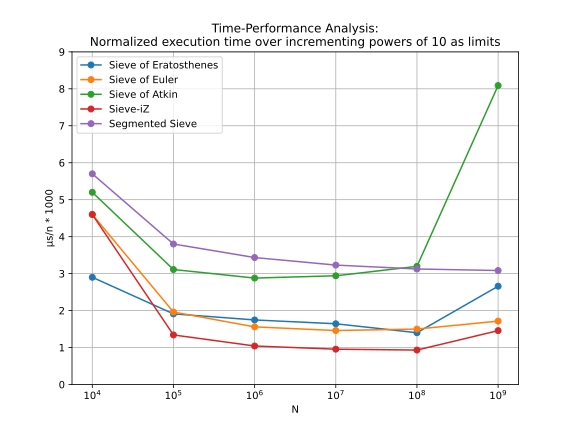
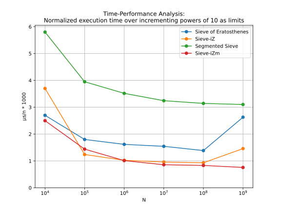
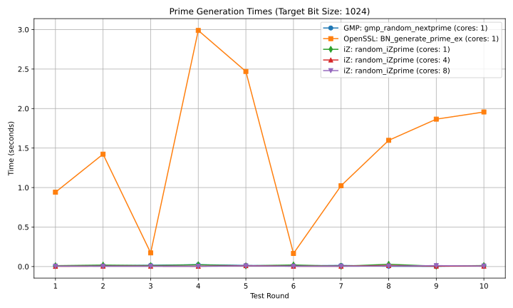
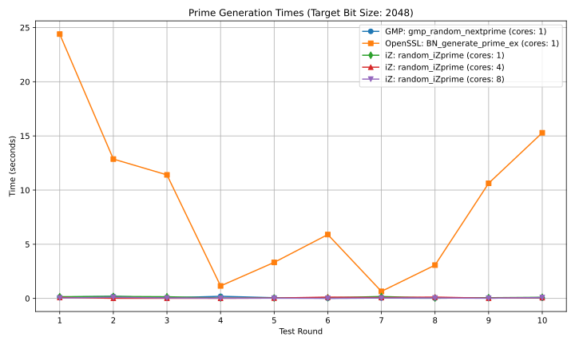
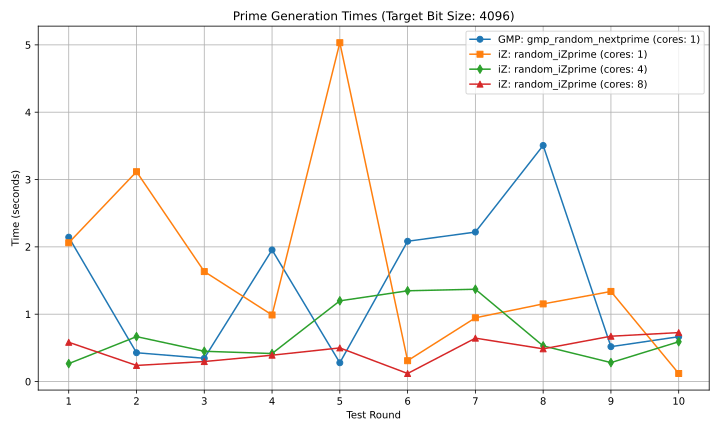
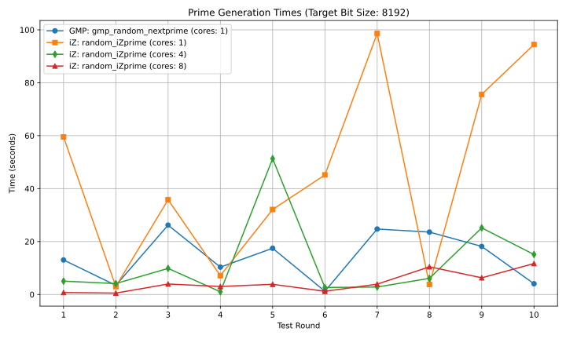

<!-- put index to headers -->

# iZ-Library

The iZ-Framework is a comprehensive suite of efficient prime sieving and generation algorithms. Detailed in the accompanying paper (main.pdf), which is under submission for peer-review, this library presents novel methods that dramatically reduce the computational burden of prime sieving through continuous refinements to tackle persistent challenges for large-scale applications.

Below are the key algorithms with benchmarks against well-optimized custom implementation of these algorithms:

- Sieve of Eratosthenes
- Segmented Sieve
- Sieve of Euler
- Sieve of Atkin

## Classic Sieve-iZ Algorithm

**• Overview:**

Focuses on numbers co-prime with 2 and 3 (i.e., numbers of the form $6x \pm 1$), thereby avoids a large portion of the redundancies that arise from considering all numbers.

**• Complexity:**

- Space: $O(\frac{n}{3})$ bits,
- Time: $O\left(\frac{n}{3} \log \log n\right)$.

**• Benchmark Comparison:**

Execution times normalized (in microseconds $\mu$) across a range $n \in [10^4, 10^5, \dots, 10^9]$ show substantial improvements over traditional algorithms such as the Sieve of Eratosthenes, Euler’s sieve, and the Sieve of Atkin.



## Segmented Sieve-iZm Algorithm

**• Overview:**

Utilizes larger wheels and strategic segmentation to decouple the sieve’s memory footprint from the input size. Achieves constant $O(1)$ space complexity requiring as little as 0.8 MB of memory while reducing the overall workload.

**• Benchmark Comparison:**

Normalized execution times (in microseconds $\mu$) are compared with the classic sieve variants, demonstrating faster execution and improved scalability.



## VX6-Sieve Algorithm

**• Overview:**

Processes the iZ-Matrix structure with a horizontal vector size defined as
$$vx6 = 5 \times 7 \times 11 \times 13 \times 17 \times 19 = 1,616,615 \text{\ bits} \approx 0.2 \text{\ MB},$$
spanning a numerical interval
$$S = 6 \times vx6 = 9,699,690.$$
It achieves linear bit complexity $O(n)$ with exceptional constant factors:

- Approximately $\frac{1}{2}S$ rapid bitwise operations.

- Approximately $\frac{4}{100}S$ primality testing operations.

- Output Efficiency:
Encodes prime gaps using a compact `uint16_t` array, significantly reducing output size for large datasets.

**• Detailed Analysis:**

The table below summarizes execution times and workload metrics for incrementing $y$ values.

| **Y** | **Execution Time** | **#Bitwise Ops** | **#Primality Testing Ops** |
|-------|-------------------:|----------------:|---------------------------:|
| $k$ | 0.032003 | 4,031,925 | 0 |
| $k \cdot g$ | 1.059171 | 4,683,431 | 382,128 |
| $k \cdot g^2$ | 2.509662 | 4,683,431 | 380,968 |
| $k \cdot g^3$ | 2.811812 | 4,683,431 | 380,293 |
| $k \cdot g^4$ | 4.342190 | 4,683,431 | 380,626 |
| $k \cdot g^5$ | 4.592591 | 4,683,431 | 380,530 |
| $k \cdot g^6$ | 5.845369 | 4,683,431 | 380,752 |
| $k \cdot g^7$ | 6.255784 | 4,683,431 | 381,379 |
| $k \cdot g^8$ | 8.821161 | 4,683,431 | 380,196 |
| $k \cdot g^9$ | 9.408612 | 4,683,431 | 380,530 |

(Here $k = 10^3$; $g = 10^9$; and $y = k \times g^i$ for $i \in [0,9]$.)

The test outputs are summarized in the table below, with each file named by the corresponding $i$ parameter:

| **i** | **Filename** | **File Size** |
|-------|-------------|---------------|
| 0     | test_0.vx6  | 844 KB        |
| 1     | test_1.vx6  | 443 KB        |
| 2     | test_2.vx6  | 301 KB        |
| 3     | test_3.vx6  | 228 KB        |
| 4     | test_4.vx6  | 183 KB        |
| 5     | test_5.vx6  | 153 KB        |
| 6     | test_6.vx6  | 132 KB        |
| 7     | test_7.vx6  | 116 KB        |
| 8     | test_8.vx6  | 103 KB        |
| 9     | test_9.vx6  | 93 KB         |

**Key Observation:** As we target larger limits, encoding prime gaps instead of storing full primes proves significantly more efficient and scalable.

## Random-iZprime Algorithm

**• Overview:**

Generates large, random primes with low latency by leveraging multi-core processing. This method is particularly effective for cryptographic applications.

**• Comparison:**

Benchmarked against **GMP’s** mpz_nextprime and **OpenSSL’s** BN_generate_prime, Random-iZprime demonstrates competitive single-core performance and significant speedups in 4-core and 8-core configurations.

Execution time (in seconds) plot for bit-size 1024 bits:



Additional plots for 2048, 4096, and 8192-bit primes are available in the output directory.







## Code Organization

- **src/**: Contains the source code

  - Modules:

    - *logger.c* (and *logger.h*): Logging utilities.

    - *bitmap.c* (and *bitmap.h*): Dynamic `unsigned char` array management, encapsulating the bit-array logic.

    - *primes_obj.c* (and *primes_obj.h*): Dynamic prime storage using `uint64_t` integer type.

    - *iZ.c* (and *iZ.h*): contains the iZ-based computations, necessary for various functionalities.
    - *utils.c* (and *utils.h*): contains basic includes and utilities required across the library.

  - Sieve Algorithms:

    - *sieve.c*: contains these algorithms [Sieve of Eratosthenes, Segmented Sieve, Wheel Sieve, Sieve of Euler, Sieve of Atkin].
    - *sieve_iZ.c*: contains these algorithms [Sieve-iZ, Sieve-iZm].
    - *test_sieve.c*: contains test_sieve_integrity for testing correctness, and benchmarking tools.
    - *vx6.c* (and *vx6.h*): contains the *VX6-Sieve* algorithm including testing tools.

  - Random Prime Generation:

    - *random_iZprime.c* (and *random_iZprime.h*): contains the *Random-iZprime* algorithm and its helper functions.
    - *test_iZprime.c*: contains testing tools against same functionalities from other libraries.

- **include/**: Contains all header files documenting the APIs.

- **build/**: Contains compilation artifacts.

- **output/**: Stores test results, benchmark logs, and SVG figures generated by Python plotting scripts, appends stdout to *stdout.txt*.

- **test/**: Contains comprehensive testing tools for all algorithms. Enable desired tests in *test/test_all.c* and execute via
`make test` to build and run tests, printing results in the console.

- **Makefile**: Use the provided Makefile to compile the project. Simply run `make` to build and run *src/main.c*, appending and printing results to *output/stdout.txt*.

- **py_scripts/**:

  - *plot_sieve_results.py* for visualizing saved benchmark results of sieve algorithms.
  - *plot_prime_gen_results.py* for visualizing saved benchmark results of prime generation algorithms.

## How to Use the Library

- Compilation:

Navigate to the root directory and run:

```bash
make
```

This compiles the project and builds the executable.

- Running Benchmarks & Tests:

  - The main entry point is defined in *src/main.c*.

  - Benchmark functions such as benchmark_sieve and test_iZprime are available to verify algorithm correctness and performance.

  - Run tests by executing the compiled binary; logs and graphs will be output to the **output/** directory.

- Visualization:

  - Use the Python script *plot_sieve_results.py* (found in the respective directories) to generate performance graphs from the benchmark logs.

### Dependencies

**C Dependencies:**

- Compiler: GCC or Clang

- Build System: Make

- Libraries:

- GMP (GNU Multiple Precision Arithmetic Library)

- OpenSSL development libraries

**Python Dependencies:**

- Python 3.x

- Matplotlib

- NumPy

### Installation Instructions

On macOS:

```bash
# Install C dependencies

brew install gcc make gmp openssl

# Set OpenSSL paths for compilation
export LDFLAGS="-L/usr/local/opt/openssl/lib"
export CPPFLAGS="-I/usr/local/opt/openssl/include"

# Install Python dependencies
pip install matplotlib numpy
```

On Linux:

```bash
# Ubuntu/Debian
sudo apt-get update
sudo apt-get install build-essential gcc make libgmp-dev libssl-dev python3 python3-pip
pip3 install matplotlib numpy
```

```bash
# CentOS/RHEL
sudo yum install gcc make gmp-devel openssl-devel python3 python3-pip
pip3 install matplotlib numpy
```

After installing dependencies, compile the project using make and run the benchmarks as per the instructions in *src/main.c*.

## Conclusion

The iZ-Library offers a significant advancement in prime sieving and prime generation. By addressing the challenges of space, time, and output complexity, the iZ-Framework and its constituent algorithms—Sieve-iZ, Sieve-iZm, VX6-Sieve, and Random-iZprime—demonstrate substantial improvements over traditional methods. Comprehensive benchmarks validate the efficiency and scalability of the proposed methods, making this library a powerful tool for computational number theory and cryptographic applications.

For further details, please refer to the paper (main.pdf) and the accompanying documentation within the repository.

## Contributing

We welcome contributions from the community! If you have ideas for further optimizations, verified performance improvements, or new features, please feel free to open an issue or submit a pull request. We encourage contributors to include detailed benchmarks and measurements with their proposals to ensure that any changes are rigorously evaluated. Your feedback and contributions will help make the iZ-Library even more robust and efficient for the community.
